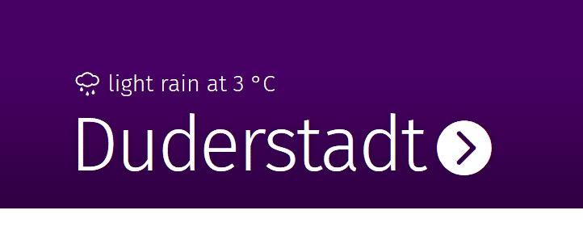
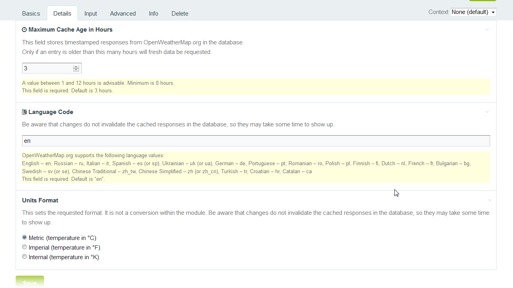
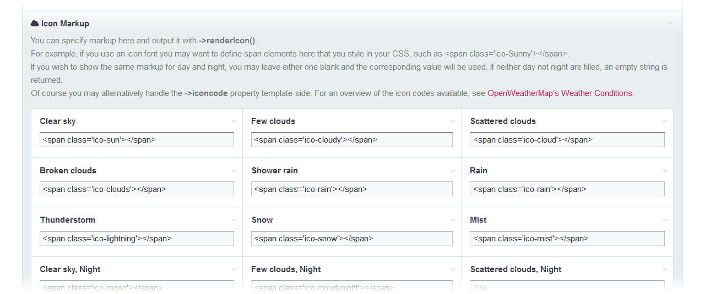

Sup.



This module fetches and stores current weather data from the [OpenWeatherMap.org service](https://openweathermap.org) and helps you manage icon markup. To limit requests, OpenWeatherMap.org’s JSON-response is cached in the database and only refreshed once the field is accessed and the cache has a certain age that you define.

The fieldtype is sadly not multilingual, but you can configure the language of the weather descriptions OpenWeatherMap.org provides you with. It would not be hard to make the output multilingual by referencing weather codes and translating them with ProcessWire’s built in tools.

You install FieldtypeOpenWeatherMap just like any other module, by placing the two files into ProcessWire’s modules directory. Once installed, you want to create a new field of the type OpenWeatherMap and assign it to a template. The template now has a text field that stores a city id.

In the field settings, you may configure how and when the data is requested. That is, the requested language, units (eg. °C/°F/K) and the cache duration.



The module does not provide you with built in icons or otherwise limits you to predefined markup (which I consider a good thing :P). The icon in my example above is courtesy of [Alessio Atzeni’s Meteocons (custom free license)](https://www.alessioatzeni.com/meteocons/).

To make generating icon markup a little easier, you can configure your own markup snippets in the module configuration:



As you can see, in this example I’m using an icon font whose appearance is defined elsewhere in my CSS, but you’re free to put in image urls or just unicode entities or whatever. Rendering it is now quite simple. The following markup would result in something like the image above:

```php
<?php
    $w = $page->weather;
    $temp = round($w->temperature);
?>
<p><?= "{$w->renderIcon()} {$w->description} at {$temp} °C"; ?></p>
```

The variable $w is now a WeatherData object that exposes the following properties:

```php
json            //The raw JSON response from OWM
timestamp       //The time of the request
city_id         //The city id you entered in the admin

sunrise         //The time of sunrise
sunset          //The time of sunset

main            //The main weather name, e. g. “Rain”, in the configured language
description     //A slightly longer, more precise description like “occasional rain”
iconcode        //The internal icon code for this weather

temperature     //The temperature in the format you requested
min_temperature //...
max_temperature //…

wind_speed      //I believe the wind speed is also affected by the unit settings.
```

As well as the method renderIcon(), which you already know. If you access a WeatherData object as a string, you will get the city id. This is so that the city id will correctly appear in the admin page edit form. I should mention that there is some more information in the JSON, such as wind direction.

The module also exposes the method multiRequest(PageArray $pages, string $fieldname). If you want to fetch data for a bunch of pages at the same time, you may want to use that so as to reduce unnecessary requests to the service. As of now, this disregards the cache freshness.